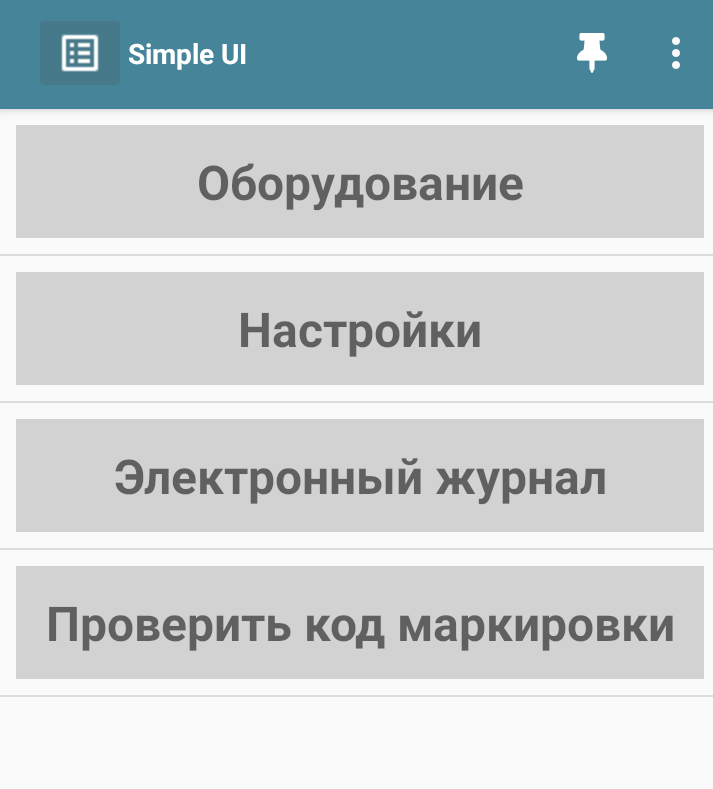
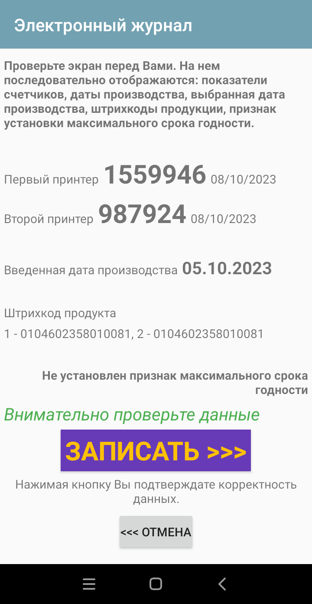

# Цех глазированных сырков

## Нанесение кодов маркировки в ручном режиме

После загрузки кодов маркировки

1. Открыть приложение Simple на мобильном устройстве.
<figure markdown>
  {width="200"}
  <figcaption>Image caption</figcaption>
</figure>

1. В открывшемся окне необходимо выбрать команду "Электронный журнал".

<figure markdown>
  {width="200"}
  <figcaption>Image caption</figcaption>
</figure>

## Отчет о вводе в оборот

<figure markdown>
  {width="200"}
  <figcaption>Image caption</figcaption>
</figure>

## Еще один раздел

<figure markdown>
  {width="200"}
  <figcaption>Image caption</figcaption>
</figure>

## Следующий раздел

<figure markdown>
  {width="200"}
  <figcaption>Рисунок 4. Успешное завершение операции.</figcaption>
</figure>

